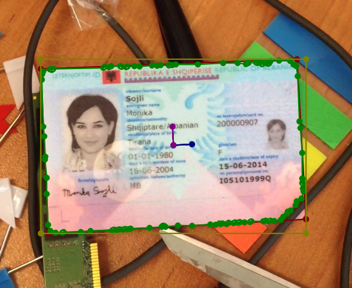
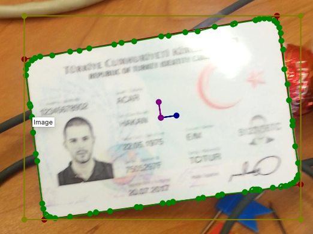
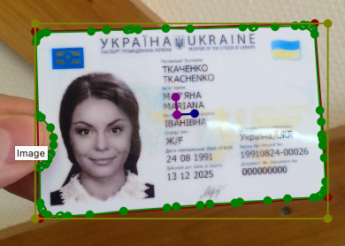
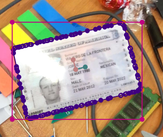

# MIDV Annotate

A python script that utilises Facebook's Segment Anything Model 2 (SAM-2) to add segmentation boundary masks, bounding boxes, and rotation angle to the MIDV500 and MIDV2019 dataset.

## How it works?

The [MIDV500](https://computeroptics.ru/eng/KO/Annot/KO43-5/430515e.html) and [MIDV2019](https://www.spiedigitallibrary.org/conference-proceedings-of-spie/11433/2558438/MIDV-2019--challenges-of-the-modern-mobile-based-document/10.1117/12.2558438.full#_=_) datasets contain videos and images taken of identity documents (IDs, Passports, Driver Licenses, etc) along with annotations of the four corners of the document in the form of four points polygons.

This script utilises this information and uses [SAM2](https://github.com/facebookresearch/segment-anything-2) to annotated segmentation mask of the boundary of the card. For each sample, we provide SAM2 with the bounding box converted from provided quad as well as a few randomly sampled key points within the quad.

The output mask, along with additional info such as the document rotation angle and bounding boxes are also calculated.

Below is the output of the annotation process:

<table>
  <tr>
   <td>
    
   </td>
   <td>
    
   </td>
   <td>
    
   </td>
   <td>
    
   </td>
  </tr>
</table>

## How to use?

1. This project relies on SAM-2. Therefore, please follow the [SAM-2 installation instruction](https://github.com/facebookresearch/segment-anything-2) to install it on your machine.
2. In the necessary packages for this project.

```shell
pip install -r requirements.txt
```

3. Run the `annotate_midv.py` file.

```shell
usage: annotate_midv.py [-h] [--labelmaps_file LABELMAPS_FILE] [--output_dir OUTPUT_DIR] [--sam2_checkpoint SAM2_CHECKPOINT] [--sam2_config SAM2_CONFIG] [--bbox_visibility_width BBOX_VISIBILITY_WIDTH]
                        [--smoothing_strength SMOOTHING_STRENGTH] [--num_key_pts_to_sample NUM_KEY_PTS_TO_SAMPLE]
                        data_dir

Using Facebook's SAM2 model to add mask, bbox, and rotation angel

positional arguments:
  data_dir              Path to a directory containing all zip files downloaded from MIDV500/MIDV2019

options:
  -h, --help            show this help message and exit
  --labelmaps_file LABELMAPS_FILE
                        Path to labelmaps file
  --output_dir OUTPUT_DIR
                        path to the output folder.
  --sam2_checkpoint SAM2_CHECKPOINT
                        path to sam2 checkpoint file
  --sam2_config SAM2_CONFIG
                        path to sam2 config file
  --bbox_visibility_width BBOX_VISIBILITY_WIDTH
                        The percentage of the bbox's width needed to be visible for the sample to be annotated
  --smoothing_strength SMOOTHING_STRENGTH
                        The percentage of the largest contour longest arc to be used as gaps between boundary markers.
  --num_key_pts_to_sample NUM_KEY_PTS_TO_SAMPLE
                        The number of key points to sample within the annotated quad to provide to SAM2
```

## Why we do this?

One of our core pipeline relies on a fast, light weight, and accurate segmentation model of id documents. In service of that, we utilises this automatically labelled data to aid with the development/research of such model.

## License

Distributed under the MIT License. See [LICENSE](./LICENSE) for more information.
